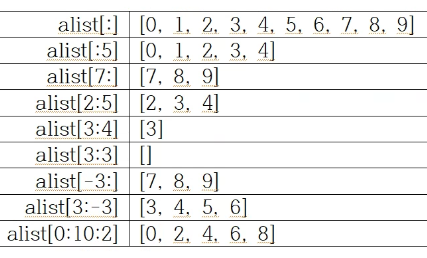

Python3

<pre>
<code>
Tips 
* <b>알파벳 대/소문자 구별</b> 
* <b>들여쓰기</b> 
    * 함수 블럭 
    * 조건절 블럭
    * 반복절 블럭
* 문자열 표시
    * "문자열" 또는 '문자열'
* 1줄 여러 실행문
    * 실행문1; 실행문2
* 여러줄 실행문
    * ...... \
      ......
* 설명문
    * 한줄 설명문 
        # 설명문
    * 여러줄 설명문 
        """
        설명문1
        설명문2
        """
</code>
</pre>


# 1 파이썬(Python) 기초

### 1.1 파이썬 시작하기 

#### 1) 파이썬 주요 Tips 

- <b>알파벳 대소문자 구별</b>
    - 알파벳 대문자와 소문자를 구별해서 사용해야 함

- 문자열 
    - "   " 또는 '   '로 감싼 알파벳, 숫자 또는 문장부호  

- 세미콜론 ;
    - 하나의 문장에 여러 실행문을 적을 때, 각 실행문을 세미콜론 ;으로 구분함     
        실행문1; 실행문2

- 백슬러쉬 \
    - 한 문장이 너무 길어 다음 줄에 이어서 작성할 때, 윗 문장 맨 뒤에 추가하는 문장 연결 표시      
        문장 중간 \     
        문장 완성
    
- 설명문 
    - \#으로 시작하는 한 줄 설명문      
        \# 설명문
    - """로 시작하여 """로 끝나는 여러줄 설명문     
        """     
        설명문1     
        설명문2     
        """
    
- <b>들여 쓰기</b>
    - 함수 정의, 조건절, 반복절 등의 블럭 정의 시 사용
        - 블럭 정의 첫번째 줄은 반드시 콜론 :으로 끝나야 함
        - 두번째 줄부터 마지막 줄은 반드시 4칸(또는 Tab 사용) 들여쓰기를 해야 함


#### 2) 파이썬 설치 및 버전 확인 

- 파이썬 설치 
    - ROSject 생성/fork 시, 매칭되는 버전의 파이썬 자동 설치됨 


- 파이썬 버전 확인

```
$ python --version 
    Python 3.8.10

```


#### 3) 파이썬 프로그램 python_start.py

- 폴더 작성 

```
$ cd ~
$ mkdir python
$ cd python 
```

- 소스 파일 python_start.py

    ~/python/python_start.py

```
"""
pythonStart:
    Case sensitive
    Indentation of if statements
    Comments
    Print statements
"""
a = 10; A = -20                           # Case sensitive # Multiple statements

if A<0:                                   # Indentation of if statements
    A = -A
    
sum = a + A                               # Sum of a & A

print("a=", a, "  A=", A, "  a+A=", sum)  # Print statements

sum2 = 1 + 2 + 3 + 4 + 5 \
       + 6 + 7 + 8 + 9 + 10
       
print(sum2)
```

- 실행 

```
$ python3 python_start.py
a= 10   A= 20   a+A= 30
55
```

### 1.2 숫자 

#### 1) 숫자 주요 Tips

- 정수(int) 
    - 정수 : int형
    - 정수 사이의 덧셈/뺄셈/곱셈 결과 : int형
    - 정수 사이의 나눗셈 결과 : float형 
    - 정수 몫, 정수 나머지     
        quotient = 7 // 3     
        remainder = 7 % 3     
        또는 quotient, remainder = divmod(7, 3)
    
- 실수(float) 
    - 유효자리 숫자(32비트, 64비트)에 의한 round-off 에러 발생
        - 실수에서는 round-off 에러로 인하여, 비교 연산자 == 사용 불가          
            a = 0.1 + 0.2     
            print(a == 0.3)
        - 함수 math.isclose( ) 사용해야 함     
            a = 0.1 + 0.2     
            print(math.isclose(a, 0.3))
                
- 분수(fractions)  
    - 분수를 사용하면, round-off 에러없이 정확하게 실수 표현 가능     
        from fractions import Fraction      
        a = Fraction(1, 10)
    
- 복소수(complex) 
    - 실수와 허수부 사용하여 복소수 표현 가능     
        a = 3 + 2j     
        b = a.conjugate()     
        c = complex(4, 2)     
        d = b \* c     
        print(d, d.real, d.img, abs(d))


#### 2) 파이썬 프로그램 number.py


- 소스 파일 number.py

    ~/python/number.py

```
a = 10.1
b = 10.2
sum = a + b
print("float:    {} + {} = {}".format(a, b, sum))

from decimal import Decimal
aDec = Decimal("10.1")
bDec = Decimal("10.2")
sumDec = aDec + bDec 
print("Decimal:  {} + {} = {}".format(aDec, bDec, sumDec))

from fractions import Fraction
aFrac = Fraction(101, 10)
bFrac = Fraction("10.2")
sumFrac = aFrac + bFrac
print("Fraction: {} + {} = {}".format(aFrac, bFrac, sumFrac))
print("Fraction: {} + {} = {}".format(float(aFrac), float(bFrac), float(sumFrac)))
```

- 실행 

```
$ python3 number.py
float:    10.1 + 10.2 = 20.299999999999997
Decimal:  10.1 + 10.2 = 20.3
Fraction: 101/10 + 51/5 = 203/10
Fraction: 10.1 + 10.2 = 20.3
```


### 1.3 문자열 

#### 1) 문자열 주요 Tips

- 문자열 표현 
    - 큰 따옴표 "로 묶거나 작은 따옴표 '로 묶음     
        "Hello, world"
            
- 문자열 배열 표현     
    \# a[0]="H", a[1]="e", ..., a[11]="d", a[12]="!"     
    a = "Hello, world!"     
            
    \# a[0:5] = a[0] + ... + a[4] = "H" + ... + "o"     
    print(a[0], a[1], a[2], a[3], a[4])      
    print(a[0:5])     
            
    \# a[:2] = a[0] + a[1] = "H" + "e"     
    b = a[:2]+"y"     
    print(b)     
            
    \# b[1:] = b[1] + b[2] = "e" + "y"     
    c = "K" + b[1:]     
    print(c)     
            
    \# a[8:12] = a[8] + ... + a[11] = "o" + ... + "d"     
    d = "W" + a[8:12]     
    print(d)     
    
- 이스케이프 문자 (백슬래쉬 \\로 시작하는 특수 문자)     
    \\n : 출력 포맷 문자열 : 줄바꾸기     
    \\t : 출력 포맷 문자열 : 탭     
    \\" : 큰따옴표(Double quote) : \"     
    \\' : 작은따옴표(Single quote) : \'     
    \\\\ : 백슬래시(Back slash) : \


#### 2) 파이썬 프로그램 string.py


- 소스 파일 string.py

    ~/python/string.py
    
    
```
str = "Hello, world!"
print(str)

print(str[0], str[1], str[2], str[3], str[4])
print(str[0] + str[1] + str[2] + str[3] + str[4])

for i in range(len(str)):
    print(str[i], end="")
print("")

for aStr in str:
    print(aStr, end="")
print("")

print([str[i] for i in range(len(str))])
```


- 실행 

```
$ python3 string.py
Hello, world!     
H e l l o     
Hello     
Hello, world!     
Hello, world!     
['H', 'e', 'l', 'l', 'o', ',', ' ', 'w', 'o', 'r', 'l', 'd', '!']
```


### 1.4 변수 

#### 1)  변수 주요 Tips

    - 변수 자료형 & 함수 type() 
        - 정수형(int) : 
            a = 2 
            print(type(a))
        - 실수형(float)
            b = 3.14 
            print(type(b))
        - 블리언(bool)
            c = True 
            print(type(c))
        - 문자열(str) 
            d = "Hello"
            print(type(d))
        - 복소수(complex) 
            e = 3 + 2j
            print(type(e))
        - 리스트(list) 
            f = [1, 2, 3]
            print(type(f))
        - 튜플(tuple) 
            g = (1, 2, 3)
            print(type(g))
        - 딕셔너리 
            h = {'a':1, 'b':2, 'c':3} 
            print(type(h))
    
    - 변수 삭제  
        - 변수 삭제는 함수 del()을 이용함 
            del(변수명) 
        - 일반적으로 변수를 삭제할 필요는 없음 
        - 리스트 등의 경우, 변수 삭제가 필요한 경우 있을 수 있음 
        - 튜플은 변수 변경이나 삭제가 불가능함 
        
    - 변수명 규칙 
        - 알파벳과 숫자, 밑줄문자 _ 를 사용할 수 있음 
        - 특수문자(+, -, *, /, $, @, &, % 등)는 사용할 수 없음 
        - 대소문자를 구분함
        - 첫글자는 알파벳이나 밑줄문자 _로 시작해야 함 (숫자는 첫글자로 사용 불가)
        - 파이썬 키워드(if, for, while, and, or 등)는 변수명으로 사용 불가 
        
    
#### 2) 파이썬 프로그램 variable.py

- 소스 파일 variable.py

    ~/python/variable.py
    
    
```
ia = 10
print("{}: \t\t{}".format(type(ia), ia))

fa = 10.34
print("{}: \t{}".format(type(fa), fa))

ca = complex(10, 34)
print("{}: \t{}".format(type(ca), ca))

sa = "10.34"
print("{}: \t\t{}".format(type(sa), sa))

ba = bool(10.34)
print("{}: \t{}".format(type(ba), ba))
```


- 실행 

```
$ python3 variable.py
<class 'int'>:          10
<class 'float'>:        10.34
<class 'complex'>:      (10+34j)
<class 'str'>:          10.34
<class 'bool'>:         True
```


### 1.5 연산자 

#### 1) 연산자 주요 Tips 

- 수학 연산자 

| 종류   | 수학 연산자 설명      | 사용 예시     |
|:-------|:----------------------|:--------------|     
|\+      | 단항 연산자 부호 유지 | +7, +x        |     
|\-      | 단항 연산자 부호 변경 | -7, -x        |     
|+       | 더하기                | 7+3 &rarr; 10 |     
|-       | 빼기                  | 7-3 &rarr; 4  |
|*       | 곱하기                | 7*3 &rarr; 21  |
|/       | 나누기                | 7/3 &rarr; 2.333333333333...  |
|**      | 거급 제곱             | 7**3 &rarr; 343  |
|//      | 정수 몫               | 7//3 &rarr; 2  |
|%       | 정수 나머지           | 7%3 &rarr; 1  |


- 관계 연산자 

| 종류   | 관계 연산자 설명      | 사용 예시         |
|:-------|:----------------------|:------------------|     
|<       | 작다                  | 7<3 &rarr; False  |     
|<=      | 작거나 같다           | 7<=3 &rarr; False |     
|>       | 크다                  | 7>3 &rarr; True   |     
|>=      | 크거나 같다           | 7>=3 &rarr; True  |
|==      | 같다                  | 7==3 &rarr; False |
|!=      | 같지 않다             | 7!=3 &rarr; True  |

    - 부등호 양쪽 관계 동시 표현 가능 
        예) 1 <= x < 5


- 논리 연산자 

| 종류   | 논리 연산자 설명      | 사용 예시                   |
|:-------|:----------------------|:----------------------------|     
|not     | 논리 부정             | not True &rarr; False       |     
|and     | 논리 곱               | True and False &rarr; False |     
|or      | 논리 합               | True or False &rarr; True   | 


- 비트 연산자 

| 종류   | 비트 연산자 설명      | 사용 예시         |
|:-------|:----------------------|:------------------|     
|~       | 단항연산자 비트 부정  | ~1 &rarr; 0, ~0 &rarr; 1 |     
|<<      | 비트 좌로 이동        | 0b1011<<1 &rarr; 0b0110  |     
|>>      | 비트 우로 이동        | 0b1011>>1 &rarr; 0b0101  |     
|&       | 비트 AND              | 1&1 &rarr; 1, 0&1 &rarr; 0, 1&0 &rarr; 0, 0&0 &rarr; 0  |
|^       | 비트 XOR              | 1^1 &rarr; 0, 0^1 &rarr; 1, 1^0 &rarr; 1, 0&0 &rarr; 0 |
|\|      | 비트 OR               | 1\|1 &rarr; 1, 0\|1 &rarr; 1, 1\|0 &rarr; 1, 0\|0 &rarr; 0 |


- 연산자 우선 순위 

| 순위   | 연산자            | 연산자 설명                     |
|:-------|:------------------|:--------------------------------|     
| 1      | ( )               | 괄호                            |     
| 2      | **                | 거듭 제곱                       |     
| 3      | 단항 연산자 + - ~ | 단항 연산자 부호 유지, 부호 변경, 비트 부정  | 
| 4      | * / // %          | 곱하기, 나누기, 정수 몫, 정수 나머지         |     
| 5      | + -               | 더하기, 빼기                    |     
| 6      | << >>             | 비트 좌로 이동, 비트 우로 이동  | 
| 7      | &                 | 비트 AND                        |     
| 8      | ^                 | 비트 XOR                        |
| 9      | \|                | 비트 OR                         | 
| 10     | == != < <= > >=   | 같다, 같지 않다, 작다, 작거나 같다, 크다, 크거나 같다 |     
| 11     | not               | 논리 부정                       |     
| 12     | and               | 논리 곱                         | 
| 13     | or                | 논리 합                         | 


#### 2) 파이썬 프로그램 operator.py

- 소스 파일 operator.py

    ~/python/operator.py
    
    
```
a = 5
b = 3

add = a + b
subt = a - b
mult = a * b
divd = a / b
divdInt = a // b
power = a ** b

print("{} + {} = {}".format(a, b, add))
print("{} - {} = {}".format(a, b, subt))
print("{} * {} = {}".format(a, b, mult))
print("{} / {} = {}".format(a, b, divd))
print("{} // {} = {}".format(a, b, divdInt))
print("{} ** {} = {}".format(a, b, power))
```


- 실행 

```
$ python3 operator.py
5 + 3 = 8
5 - 3 = 2
5 * 3 = 15
5 / 3 = 1.6666666666666667
5 // 3 = 1
5 ** 3 = 125
```


### 1.6 range

#### 1) range 주요 Tips 

- range 인수  
    - 3개 인수 : 
        - range(시작값, 끝값, 간격)
            - 시작값 : 시작값 부터 
            - 끝값 : <span style="color:red">끝값 직전까지</span> 
            - 간격 : 증감값 
    - 2개 인수 : 
        - range(시작값, 끝값)
            - 시작값 : 시작값 부터 
            - 끝값 : <span style="color:red">끝값 직전까지</span>  
            - <span style="color:red">default 간격 = 1</span> 
    - 1개 인수 : 
        - range(끝값)
            - <span style="color:red">default 시작값 = 0</span>  
            - 끝값 : <span style="color:red">끝값 직전까지</span>  
            - <span style="color:red">default 간격 = 1</span> 

#### 2) 파이썬 프로그램 range.py

- 소스 파일 range.py

    ~/python/range.py
    
    
```
a = range(5)
print(a, "\t", list(a))

b = range(1, 10, 2)
print(b, "\t", list(b))

c = range(5, 0, -1)
print(c, "\t", list(c))

d = [x for x in range(5)]
print(d)

e = [x**2 for x in range(5)]
print(e)

sum=0
for x in range(5):
    sum = sum + x
print(sum)
```


- 실행 

```
$ python3 range.py
range(0, 5)              [0, 1, 2, 3, 4]
range(1, 10, 2)          [1, 3, 5, 7, 9]
range(5, 0, -1)          [5, 4, 3, 2, 1]
[0, 1, 2, 3, 4]
[0, 1, 4, 9, 16]
10
```


### 1.7 리스트(list)

#### 1) list 주요 Tips 

- list 정의 
    - 대괄호 [ ] 로 표시 
        alist = [ ... ] 
    - 요소 표현 : [요소0, 요소1, 요소2, ...]
        alist = [10, 20, 30, ..., 80, 90] 
    - 인덱스 표현 : 리스트[0], 리스트[1], 리스트[2], ..., 리스트[8] 
        alist[0], alist[1], ..., alist[8] 
    - 리스트는 Mutable 함 (요소의 추가, 변경, 삭제 가능함) 
        alist[0] = 100 수정 가능 &larr; alist[0] = 10

- list 입력 
    - 직접 입력 
        alist = [10, 20, 30, 40, 50, 60, 70, 80, 90]
    - range 입력 
        alist = list(range(10, 100, 10))
    - 함수 len()
        len(alist)

- 언패킹(unpacking) 
    - list 요소를 한 번에 여러 변수에 할당하는 것 
        x0, x1, x2, x3, x4, x5, x6, x7, x8 = alist

- 슬라이싱 
    - list 요소 중에 일부를 잘라내어 복사하는 것, 인덱스를 사용함 
    - 리스트[m:n:p] : 
        인덱스 m부터     
        <span style="color:red">인덱스 n 직전까지</span>     
        인덱스 p 간격으로     
    - 리스트[m:n] : 
        인덱스 m부터     
        <span style="color:red">인덱스 n 직전까지</span>     
        인덱스 1 간격으로     
    - 리스트[m:] : 
        인덱스 m부터     
        인덱스 끝까지     
        인덱스 1 간격으로     
    - 리스트[:n] : 
        인덱스 0부터     
        <span style="color:red">인덱스 n 직전까지</span>     
        인덱스 1 간격으로     
    - 리스트[:] : 
        인덱스 0부터     
        인덱스 끝까지     
        인덱스 1 간격으로     
    - 양의 인덱스, 음의 인덱스 
        - 양의 인덱스 : 리스트 인덱스 시작부터 우측으로 0, 1, 2, ...     
        - 음의 인덱스 : 리스트 인덱스 끝부터 좌측으로  -1, -2, -3, ...     
        


    - 슬라이싱 예시 : alist(10) = [0, 1, 2, ..., 8, 9]




#### 2) 파이썬 프로그램 list.py

- 소스 파일 list.py

    ~/python/list.py
    
    
```
a = [10, 20, 30, 40, 50]
print(type(a), len(a), a)
print(a[2])

b = a[::2]
print(type(b), len(b), b)

b0, b1, b2 = b
print(b0, b1, b2)
```


- 실행 

```
$ python3 list.py
<class 'list'> 5 [10, 20, 30, 40, 50]
30
<class 'list'> 3 [10, 30, 50]
10 30 50
```


### 1.8 튜플(tuple)

#### 1) tuple 주요 Tips 

- tuple 정의 
    - 소괄호 ( ) 로 표시 
        atuple = ( ... ) 
    - 요소 표현 : (요소0, 요소1, 요소2, ...)
        atuple = (10, 20, 30, ..., 80, 90) 
    - 인덱스 표현 : 튜플[0], 튜플[1], 튜플[2], ..., 튜플[8]
        atuple[0], atuple[1], ..., atuple[8] 
    - 리스트는 Immutable 함 (요소의 추가, 변경, 삭제 불가능함) 
        atuple[0] = 100 수정 불가능, 오류 &larr; atuple[0] = 10

- tuple 입력 
    - 직접 입력 
        atuple = (10, 20, 30, 40, 50, 60, 70, 80, 90)
    - range 입력 
        atuple = tuple(range(10, 100, 10))
    - 함수 len()
        len(atuple)

- 언패킹(unpacking) 
    - tuple 요소를 한 번에 여러 변수에 할당하는 것 
        x0, x1, x2, x3, x4, x5, x6, x7, x8 = atuple

- 슬라이싱 
    - tuple 요소 중에 일부를 잘라내어 복사하는 것, 인덱스를 사용함 
    - 튜플[m:n:p] : 
        인덱스 m부터     
        <span style="color:red">인덱스 n 직전까지</span>     
        인덱스 p 간격으로     
    - 튜플[m:n] : 
        인덱스 m부터     
        <span style="color:red">인덱스 n 직전까지</span>     
        인덱스 1 간격으로     
    - 튜플[m:] : 
        인덱스 m부터     
        인덱스 끝까지     
        인덱스 1 간격으로     
    - 튜플[:n] : 
        인덱스 0부터     
        <span style="color:red">인덱스 n 직전까지</span>     
        인덱스 1 간격으로     
    - 튜플[:] : 
        인덱스 0부터     
        인덱스 끝까지     
        인덱스 1 간격으로     
    - 양의 인덱스, 음의 인덱스 
        - 양의 인덱스 : 튜플 인덱스 시작부터 우측으로 0, 1, 2, ...     
        - 음의 인덱스 : 튜플 인덱스 끝부터 좌측으로  -1, -2, -3, ...     


#### 2) 파이썬 프로그램 tuple.py

- 소스 파일 tuple.py

    ~/python/tuple.py
    
    
```
a = (10, 20, 30, 40, 50)
print(type(a), len(a), a)
print(a[2])

b = a[::2]
print(type(b), len(b), b)

b0, b1, b2 = b
print(b0, b1, b2)
```


- 실행 

```
$ python3 tuple.py
<class 'tuple'> 5 (10, 20, 30, 40, 50)
30
<class 'tuple'> 3 (10, 30, 50)
10 30 50
```


### 1.9 딕셔너리(dict)

#### 1) dict 주요 Tips 

- dict 정의 
    - 리스트/튜플과 딕셔너리 차이 
        - 리스트/튜플 : 인덱스 기반 시퀀스 자료 
        - 딕셔너리 : 인덱스 기반 아닌, 키워드 기반 시퀀스 자료 
    - 중괄호 { } 로 표시 
        adict = { ... } 
    - 요소 표현 : {키워드1:값1, 키워드2:값2, 키워드3:값3, ...}
        adict = {"x0":10, "x1":20, ..., "x8":90} 
    - 키워드 표현 : 딕셔너리["x0"], 딕셔너리["x1"], 딕셔너리["x2"], ..., 딕셔너리["x8"]
        adict["x0"], adict["x1"], ..., adict["x8"] 
    - 딕셔너리의 키워드는 Immutable(요소의 변경 불가능함), 값은 mutable 함 (요소의 변경 가능함) 
        adict["x0"] = 100 수정 가능 &larr; adict["x0"] = 10

- dict 입력 
    - 직접 입력 
        딕셔너리 = {키워드1:값1, 키워드2:값2, 키워드3:값3, ...}     
        딕셔너리 = dict(키워드1=값1, 키워드2=값2, 키워드2=값2, ...)     
        딕셔너리 = dict(zip([키워드1, 키워드2, 키워드3, ...], [값1, 값2, 값3, ...]))     
        딕셔너리 = dict([키워드1, 키워드2, 키워드3, ...], [값1, 값2, 값3, ...])     
    - 함수 len()
        len(adict)

- 언패킹(unpacking) 
    - dict 요소를 한 번에 함수의 여러 인수에 할당하기 위한 조건  
        - dict의 키워드 갯수를 함수 매개변수 갯수와 동일하게 지정, 
        - dict의 키워드 이름들을 함수 매개변수 이름들과 동일하게 지정, 
        - 함수 호출 시 인수를 dict의 더블 포인트로 사용, 
        - dict 언패킹 

```
def test(a, b, c):
    ......
    
adict = {"a":1, "b":2, "c":3}
result = test(**adict) 
```
        

#### 2) 파이썬 프로그램 dict.py

- 소스 파일 dict.py

    ~/python/dict.py
    
    
```
a = {0:10, 1:20, 2:30, 3:40, 4:50}
print(type(a), len(a), a)
print(a[2])

bkey = ("b0", "b1", "b2")
bval = range(100, 400, 100)
b = dict(zip(bkey, bval))
print(type(b), len(b), b)
print(b["b1"])

def abc(b0, b1, b2):
    print(b0, b1, b2)

abc(**b)
```


- 실행 

```
$ python3 dict.py
<class 'dict'> 5 {0: 10, 1: 20, 2: 30, 3: 40, 4: 50}
30
<class 'dict'> 3 {'b0': 100, 'b1': 200, 'b2': 300}
200
100 200 300
```


### 1.10 for 반복문 

#### 1) for 반복문 주요 Tips 

- for 반복문   
    - range 이용 for 반복문
    
```
for 변수 in range(시작값, 끝값, 간격): 
    실행문1
    실행문2
    ......
```
    - 시퀀스 객체(리스트 또는 튜플) 이용 for 반복문: 

```
for 변수 in 리스트:
    실행문1
    실행문2
    ......
```

    - 딕셔너리 이용 for 반복문 
    
```
for key변수 in 딕셔너리:
    실행문1
    실행문2
    ......
```

또는 

```
for key변수 in 딕셔너리.keys():
    실행문1
    실행문2
    ......
```

또는 

```
for val변수 in 딕셔너리.values():
    실행문1
    실행문2
    ......
```

또는 

```
for key변수, val변수 in 딕셔너리.items():
    실행문1
    실행문2
    ......
```

    - zip 이용 for 반복문 
    
```
for 변수1, 변수2 in zip(리스트1, 리스트2):
    실행문1
    실행문2
    ......
```


#### 2) 파이썬 프로그램 for.py

- 소스 파일 for.py

    ~/python/for.py
    
    
```
# for using range
sum = 0
for i in range(2, 11, 2):
    sum = sum + i
print(sum)

# for using list
al = [2, 3.14, "Hello", True]
for i in range(len(al)):
    print(al[i])
for x in al:
    print(x)

al2d = [[1, 1], [2, 4], [3, 9], [4, 16]]
for i in range(len(al2d)):
    for j in range(len(al2d[i])):
        print(al2d[i][j])
for ia in al2d:
    print(ia[0], ia[1])
for ia1, ia2 in al2d:
    print(ia1, ia2)

# for using dict 
ad = {"name":"홍길동", "age":21, "msc":True}

for key in ad:
    print(key, ad[key])

for key in ad.keys():
    print(key, ad[key])

for value in ad.values():
    print(value)

for key in ad.keys():
    print(key, ad[key])

for key, value in ad.items():
    print(key, value)
```


- 실행 

```
$ python3 for.py
30
2
3.14
Hello
True
2
3.14
Hello
True
1
1
2
4
3
9
4
16
1 1
2 4
3 9
4 16
1 1
2 4
3 9
4 16
name 홍길동
age 21
msc True
name 홍길동
age 21
msc True
홍길동
21
True
name 홍길동
age 21
msc True
name 홍길동
age 21
msc True
```


### 1.11 while 반복문 

#### 1) while 반복문 주요 Tips 

- 조건절 이용 while 반복문   
    - 조건절이 참이면, 반복 계속 
    - 조건절이 거짓이면, 반복 종료 
    
```
while 조건절: 
    실행문1
    실행문2
    ......
```


#### 2) 파이썬 프로그램 while.py

- 소스 파일 while.py

    ~/python/while.py
    
    
```
i = 2
sum = 0
while i<=10:
    sum = sum + i
    i = i + 2
print(sum)
```


- 실행 

```
$ python3 while.py
30
```


### 1.12 break, continue  

#### 1) break/continue 주요 Tips 

- break    
    - 반복문/조건절에서 break를 만나면, 종료 

```
for 변수 in range(끝값):
    ‧‧‧‧‧‧
    if 조건절:
        break
    ‧‧‧‧‧‧
```

또는 

```
while True:
    ‧‧‧‧‧‧
    if 조건절:
        break
    ‧‧‧‧‧‧
```

- continue 
    - 반복문/조건절에서 continue를 만나면, 계속 
    
```
for 변수 in range(끝값)
    ‧‧‧‧‧‧
    if 조건절:
        continue
    ‧‧‧‧‧‧
```


#### 2) 파이썬 프로그램 break_continue.py

- 소스 파일 break_continue.py

    ~/python/break_continue.py
    
    
```
i = 2
sum = 0
while True:
    if i <= 10:
        sum = sum + i
        i = i + 2
        continue
    break 
print(sum)
```


- 실행 

```
$ python3 break_continue.py
30
```


### 1.13 if 조건문   

#### 1) if 조건문 주요 Tips 

- if 조건문 
    - 조건절이 참이면, if 블럭 실행 
    - 조건절이 거짓이면, 건너뜀

```
if 조건절: 
    실행문1
    실행문2
    ‧‧‧‧‧‧
```


- if else 조건문  
    - 조건절이 참이면, if 블럭 실행 
    - 조건절이 거짓이면, else 블럭 실행 
    
```
if 조건절:
    실행문1
else:
    실행문2
```


- if elif else 조건문 
    - 조건절1이 참이면, if 블럭 실행 
    - 조건절1이 거짓이고 조건절2가 참이면, elif 블럭 실행 
    - 조건절1이 거짓이고 조건절2가 거짓이면, else 블럭 실행 

```
if 조건절1:
    실행문1
elif 조건절2:
    실행문2
else:
    실행문3
```


#### 2) 파이썬 프로그램 if.py

- 소스 파일 if.py

    ~/python/if.py
    
    
```
def control2(a, b):
    if a  > b:
        print("%d > %d" % (a, b))
    else:
        print("{0} <= {1}".format(a, b))
control2(10, 5)
control2(3, 5)

def control3(a, b):
    if a  > b:
        print("%d > %d" % (a, b))
    elif a < b:
        print("{0} < {1}".format(a, b))
    else:
        print(a, "==", b)
control3(10, 5)
control3(3, 5)
control3(5, 5)
```


- 실행 

```
$ python3 if.py
10 > 5
3 <= 5
10 > 5
3 < 5
5 == 5
```


### 1.14 사용자정의함수(User Defined Function)   

#### 1) 사용자정의함수 주요 Tips 

- 리스트/튜플 반환값 언패킹  
    - 리스트를 반환하면서, 언패킹 가능
    - 튜플을 반환하면서, 언페킹 가능 

```
def returnTuple():
    return (1, 2)
x, y = returnTuple()
```

또는 

```
def returnList():
    return [1, 2]
x, y = returnList()
```


- 딕셔너리 매개변수 언패킹 
    - 딕셔너리를 함수의 매개변수로 지정하면서, 언패킹 가능 

```
def callFuncArgDict(a, b, c):
	return a + b + c

d = {"a":10, "b":20, "c":30}
sum = callFuncArgDict(**d)
```


#### 2) 파이썬 프로그램 udf.py

- 소스 파일 udf.py

    ~/python/udf.py
    
    
```
from numpy import sqrt

def solveQuad(a, b, c):
    """
    Solve a*x**2 + b*x + c = 0
    """
    d = b**2 - 4*a*c
    if d >= 0:
        x1 = (-b-sqrt(d))/(2*a)
        x2 = (-b+sqrt(d))/(2*a)
    else:
        x1 = complex(-b, -sqrt(-d))/(2*a)
        x2 = x1.conjugate()
    return [x1, x2]

d1 = {"a":1, "b":-2, "c":-3}
d2 = {"a":1, "b":-2, "c":1}
d3 = {"a":1, "b":-2, "c":5}
ans1, ans2 = solveQuad(**d1)
print(ans1, ans2)
ans1, ans2 = solveQuad(**d2)
print(ans1, ans2)
ans1, ans2 = solveQuad(**d3)
print(ans1, ans2)
```


- 실행 

```
$ python3 udf.py
-1.0 3.0
1.0 1.0
(1-2j) (1+2j)
```


### 1.15 전역변수와 지역변수    

#### 1) 전역변수와 지역변수 주요 Tips 

- 전역변수와 지역변수 
    - 지역변수 : 블럭 내부에서 정의된 변수 
        - 블럭 내에서만 사용 가능 
    - 전역변수 : 블럭 외부에서 정의된 변수 
        - 블럭 내외에서 모두 사용 가능 

- 블럭 내에서 지역변수 사용하기

```
a = 100			# Global variable
b = 200			# Global variable
	
def add():
    a = 10		# Local variable
    b = 20		# Local variable
    print(a+b) 	# Local variable, Result is 30(=10+20)
	
add()
print(a+b)		# Global variable, Result is 300(=100+200)
```

- 블럭 내에서 전역변수 사용하기 

```
a = 100			# Global variable
b = 200			# Global variable
	
def add():
    global a	# Global variable
    global b	# Global variable
    print(a+b) 	# Global variable, Result is 300(=100+200)
	
add()
print(a+b)		# Global variable, Result is 300(=100+200)
```


#### 2) 파이썬 프로그램 localVariable_globalVariable.py

- 소스 파일 localVariable_globalVariable.py

    ~/python/localVariable_globalVariable.py
    
    
```
def sum(a, b):          # arguements
    return a+b

def sumLocal():
    a = 10              # local variables
    b = 20
    return a+b

def sumGlobal():
    global a            # global variable
    global b
    return a+b

a = 100                 # global variable
b = 200

print("func arg: \t", sum(a, b))
print("local var: \t", sumLocal())
print("global var: \t", sumGlobal())
```


- 실행 

```
$ python3 localVariable_globalVariable.py
func arg: 	 300
local var: 	 30
global var:  300
```


### 1.16 람다 함수     

#### 1) 람다 함수 주요 Tips 

- 람다 함수 정의 및 호출 

    함수명 = lambda 매개변수: 계산식     
    변수 = 함수명(인수값)

```
func = lambda x: x + 10
a = func(3)
```

- 표현식 직접 호출 

    변수 = (lambda 매개변수: 계산식)(인수값)

```
a = (lambda x: x + 10)(3)
```


#### 2) 파이썬 프로그램 lambda.py

- 소스 파일 lambda.py

    ~/python/lambda.py
    
    
```
func = lambda x, y : x + y

a = 10
b = 100
c = func(a, b)
print(a, b, c)
```


- 실행 

```
$ python3 lambda.py
10 100 110
```


### 1.17 리스트 컴프리헨션 (list comprehension)     

#### 1) 리스트 컴프리헨션 주요 Tips 

- for문 이용 리스트 컴프리헨션  
    
    리스트 = [계산식 for 변수 in 리스트]     
    또는     
    리스트 = [계산식 for 변수 in range(시작, 끝, 간격)]

```
a = [2*x for x in [1, 2, 3, 4, 5, 6, 7]] 
b = [i+10 for i in range(10)] 
```


- if문 이용 리스트 컴프리헨션  

    리스트 = [계산식 for 변수 in 리스트 if 조건절]
    또는 
    리스트 = [계산식 for 변수 in range(시작, 끝, 간격) if 조건절]

```
a = [2*x for x in [1, 2, 3, 4, 5, 6, 7] if x%2 == 0] 
b = [i+10 for i in range(10) if i%2 == 0] 
```


- 이중 for문 이용 리스트 컴프리헨션  

    리스트 = [계산식 for 변수1 in 리스트1 for 변수2 in 리스트2]

```
a = [x + y for x in ["a", "b", "c"] for y in ["1", "2", "3"]]
```


#### 2) 파이썬 프로그램 listComprehension.py

- 소스 파일 listComprehension.py

    ~/python/listComprehension.py
    
    
```
al = [10*i for i in range(11)]
print(al)

bl = [10*i for i in range(11) if i%2 == 0]
print(bl)

cl = [10*i+j for i in range(11) for j in range(11)]
print(cl)

dl = [10*i+j for i in range(11) if i%2 == 0 for j in range(11) if j%2 == 0]
print(dl)
```


- 실행 

```
$ python3 listComprehension.py
[0, 10, 20, 30, 40, 50, 60, 70, 80, 90, 100]
[0, 20, 40, 60, 80, 100]
[0, 1, 2, 3, 4, 5, 6, 7, 8, 9, 10, 10, 11, 12, 13, 14, 15, 16, 17, 18, 19, 20, 20, 21, 22, 23, 24, 25, 26, 27, 28, 29, 30, 30, 31, 32, 33, 34, 35, 36, 37, 38, 39, 40, 40, 41, 42, 43, 44, 45, 46, 47, 48, 49, 50, 50, 51, 52, 53, 54, 55, 56, 57, 58, 59, 60, 60, 61, 62, 63, 64, 65, 66, 67, 68, 69, 70, 70, 71, 72, 73, 74, 75, 76, 77, 78, 79, 80, 80, 81, 82, 83, 84, 85, 86, 87, 88, 89, 90, 90, 91, 92, 93, 94, 95, 96, 97, 98, 99, 100, 100, 101, 102, 103, 104, 105, 106, 107, 108, 109, 110]
[0, 2, 4, 6, 8, 10, 20, 22, 24, 26, 28, 30, 40, 42, 44, 46, 48, 50,60, 62, 64, 66, 68, 70, 80, 82, 84, 86, 88, 90, 100, 102, 104, 106,108, 110]
```


### 1.18 리스트 map, filter      

#### 1) 리스트 map 사용하기  

- 함수 사용 리스트 map   

    리스트 = list(map(함수명, 값 리스트))
    
- lambda 함수 사용 리스트 map   
   
    함수명 = lambda 매개변수: 계산식
    리스트 = list(map(함수명, 값 리스트))
    또는, 
    리스트 = list(map(lambda 매개변수: 계산식, 값 리스트))

```
square = lambda x: x**2
a = [1, 2, 3, 4]
a_square = list(map(square, a)) 
```


- 사용자정의함수 사용 리스트 map 

    def 함수명(매개변수):
        ‧‧‧‧‧‧
        return 반환값

    리스트 = list(map(함수명, 값 리스트))


```
def myAbs(x):
    if(x<0):
        x = -x
    return x

a = [-2.4, -0.5, 0.3, 0.7]
a_abs = list(map(myAbs, a))
```


- 내장함수 사용 리스트 map 

    리스트 = list(map(내장 함수명, 값 리스트))


```
a = [1.2, 2.5, 3.7, 4.6]
a_int = list(map(int, a))
```


#### 2) 리스트 filter 사용하기  

- filter : 리스트의 각각의 요소에 대하여, 지정된 함수가 참인 경우에만 선별하여 리스트 요소를 반환함

    리스트 = list(filter(함수명, 값 리스트))

```
a = [-2.4, -0.5, 0.3, 0.7]
a_positive = list(filter(lambda x: True if x>0 else False, a))
```


#### 3) 파이썬 프로그램 map_filter.py

- 소스 파일 map_filter.py

    ~/python/map_filter.py
    
    
```
a = list(range(-10, 11, 2))
print(a)

a_abs = list(map(lambda x: x if x>0 else -x, a))
print(a_abs)

a_pos = list(filter(lambda x: True if x>0 else False, a))
print(a_pos)
```


- 실행 

```
$ python3 map_filter.py
[-10, -8, -6, -4, -2, 0, 2, 4, 6, 8, 10]
[10, 8, 6, 4, 2, 0, 2, 4, 6, 8, 10]
[2, 4, 6, 8, 10]
```


### 1.19 print       

#### 1) print 주요 Tips 

- 변수/값 나열 print 

    print(변수 또는 값, …)

```
a = 10
b = 20
c = a + b
print(a, b, c)
```


- sep, end 이용 print

    print(변수 또는 값, …, sep="\t", end="\n")


```
print(a, b, c, sep=" : ")
print(a, end=" : "); print(b, end=" : "); print(c) 
```


- % 문자열 포맷 지정(%d, %f, %s) 이용 print

    print("%d  %f  %s"%(정수 변수, 실수 변수, 문자열 변수))


```
a = 100
b = 123.456
c = "Hello"
print(" a=%9d,\n b=%9.3f,\n c=%9s"%(a, b, c))
```


- str.format 이용 print

    print("{} {} {}".format(변수1, 변수2, 변수3))
    print("{0} {1} {2}".format(변수1, 변수2, 변수3))
    print("{0[변수1]} {0[변수2]} {0[변수3]}".format(locals()))
    print("{변수1} {변수2} {변수3}".format(**locals()))


```
a = 10
b = 20
c = a + b
print("{} + {} = {}".format(a, b, c))
print("{0} + {1} = {2}".format(a, b, c))
print("{0[a]} + {0[b]} = {0[c]}".format(locals()))
print("{a} + {b} = {c}".format(**locals()))
```


#### 2) 파이썬 프로그램 print.py

- 소스 파일 print.py

    ~/python/print.py
    
    
```
a = 10
b = 20
c = a + b
print("{} + {} = {}".format(a, b, c))
print("{0} + {1} = {2}".format(a, b, c))
print("{0[a]} + {0[b]} = {0[c]}".format(locals()))
print("{a} + {b} = {c}".format(**locals()))

print(a, b, c)
print(a, b, c, sep=" : ")
print(a, end=" : "); print(b, end=" : "); print(c)

a = 100
b = 123.456
c = "Hello"
print(" a=%9d,\n b=%9.3f,\n c=%9s"%(a, b, c))

a = 10
b = 20
c = a + b
print("{} + {} = {}".format(a, b, c))
print("{0} + {1} = {2}".format(a, b, c))
print("{0[a]} + {0[b]} = {0[c]}".format(locals()))
print("{a} + {b} = {c}".format(**locals()))
```


- 실행 

```
$ python3 print.py
10 + 20 = 30
10 + 20 = 30
10 + 20 = 30
10 + 20 = 30
10 20 30
10 : 20 : 30
10 : 20 : 30
 a=      100,
 b=  123.456,
 c=    Hello
10 + 20 = 30
10 + 20 = 30
10 + 20 = 30
10 + 20 = 30
```


### 1.20 모듈  

- 모듈의 목적     
    1) 저장      
    2) 재사용 


#### 1) 파이썬 스크립트 파일 print_add.py 저장 및 직접 실행

- 파일 print_add.py 

    ~/python/print_add.py

```
def add(a, b):
    c = a + b
    print("a={0}, b={1}, c={2}".format(a, b, c))

a = 3
b = 2
add(a, b) 
```

- 실행 

```
$ python3 print_add.py
a=3, b=2, c=5
```


#### 2) 파일 print_add.py 재사용 문제점  

- 파일 module_test.py 

    ~/python/module_test.py 

```
import print_add 

p = 100
q = 200

print_add.add(p, q) 
```

- 실행 

```
$ python3 module_test.py
a=3, b=2, c=5
a=100, b=200, c=300
```

- 문제점 분석 
    - 파일 module_test.py에서 파일 print_add.py의 함수 add()를 재사용하기 위하여 
    - 파일 module_test.py 내에서 import print_add 를 선언하는 순간 
    - 파일 print_add.py가 실행되어 a=3, b=2일 때의 계산결과 "a=3, b=2, c=5"이 출력되고 
    - 파일 module_test01.py 내에서 p = 100, q = 200 일 때, print_add.add(p, q)가 실행되어 "a=100, b=200, c=300"이 출력됨
    - 문제점 : 직접 실행에서의 출력 "a=3, b=2, c=5"이, 모듈 재사용 시에도 자동 실행됨
    - 해결책 : 출력 "a=3, b=2, c=5"이 직접 실행 시에만 실행되고, 모듈 재사용 시에는 실행되지 않아야 함.


#### 3) 재사용을 위한 파일 print_add_modify.py 수정  

- 파일 print_add_modify.py 

    ~/python/print_add_modify.py 

```
def add(a, b):
    c = a + b
    print("a={0}, b={1}, c={2}".format(a, b, c))

print("__name__ = {0}".format(__name__))
if __name__ == "__main__":
    a = 3
    b = 2
    add(a, b) 
```


- 실행 

```
$ python3 print_add_modify.py
__name__ = __main__
a=3, b=2, c=5
```

- 분석 
    - 파일 print_add_modity.py 직접 실행 시, 변수 \_\_name\_\_ 값이 "\_\_main\_\_"이므로, if 문의 내의 add()가 실행 되어 "a=3, b=2, c=5"가 출력됨 
    - 직접 실행 시 아무런 문제 없음


#### 4) 파일 print_add_modify.py 재사용 해결방법  

- 파일 module_test_modify.py 

    ~/python/module_test_modify.py 

```
import print_add_modify 

p = 100
q = 200

print_add_modify.add(p, q) 
```

- 실행 

```
$ python3 module_test_modify.py     
__name__ = print_add_modify     
a=100, b=200, c=300     
```

- 분석 
    - 파일 module_test_modify.py에서 파일 print_add_modify.py의 함수 add()를 재사용하기 위하여 
    - 파일 module_test_modify.py 내에서 import print_add_modify 를 선언하는 순간 
    - 파일 print_add_modify.py가 실행되지만, 변수 \_\_name\_\_ 값이 모듈 재사용 이름 "print_add_modify"이 되어, if 조건문 내의 a=3, b=2일 때의 계산결과 "a=3, b=2, c=5"이 실행되지 않는다.  
    - 파일 module_test01.py 내에서 p = 100, q = 200 일 때, print_add.add(p, q)만 실행되어 "a=100, b=200, c=300"만 출력됨
    - 해결책 : 출력 "a=3, b=2, c=5"이 직접 실행 시에만 실행되고, 모듈 재사용 시에는 실행되지 않음.
    


#### 5) 파일 print_add_final.py 재사용 최종 방법 


- 파일 print_add_final.py 

    ~/python/print_add_final.py 

```
def add(a, b):
    c = a + b
    print("a={0}, b={1}, c={2}".format(a, b, c))

if __name__ == "__main__":     
    a = 3     
    b = 2     
    add(a, b)      
```


- 파일 module_test_final.py 

    ~/python/module_test_final.py 

```
import print_add_final 

p = 100
q = 200

print_add_final.add(p, q) 
```

- 실행 

```
$ python3 module_test_final.py
a=100, b=200, c=300 
```

- 분석 
    - 직접 실행 시, if 조건절 내의 a=3, b=2, add(a, b)가 실행되고, 
    - 모듈 재사용 시, 모듈 재사용 내의 p=100, q=200, add(p, q)가 실행됨

    


